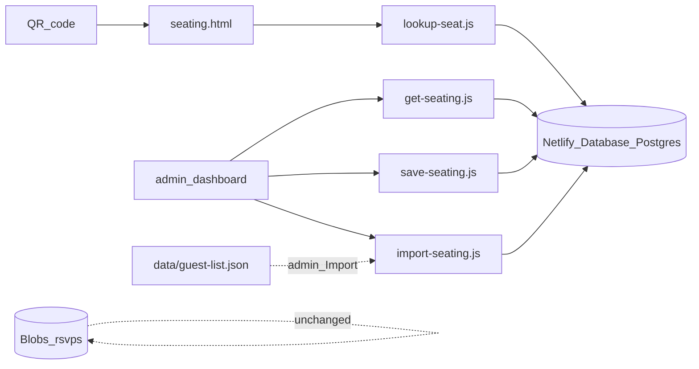

# Seating plan (QR lookup + admin chart)

## Goal

Guests scan a QR code → `[/seating](views/seating.html)` → enter name → modal:

> Welcome [GuestName], thanks for joining us. You will enjoy the night at table [TableLabel].

You manage assignments for **10 round tables (8 seats each)** plus **1 Prestataires** table (vendors + walk-ins). The Notion list you shared (~65 named guests) becomes the master roster; seating is **per person**, not per RSVP party (RSVP blobs only store party `name` + `guests` count and are not suitable for this).




## Storage decision: Netlify Database vs Blobs


|                    | **Netlify Database (recommended)**                                                   | **Netlify Blobs (fallback)**                          |
| ------------------ | ------------------------------------------------------------------------------------ | ----------------------------------------------------- |
| **Management**     | One row per guest; move a guest with a single `UPDATE`; easy counts per table in SQL | One JSON document; every save rewrites the full chart |
| **Lookup**         | Indexed query on `name_normalized`                                                   | Parse full JSON on each lookup                        |
| **Implementation** | New dep + SQL migration (~1 extra hour)                                              | Reuses existing `@netlify/blobs` pattern exactly      |
| **Testing**        | Deploy previews get isolated DB branches (safe to test seating before event)         | Shared blob store per environment                     |
| **Requirements**   | Netlify **credit-based plan**; DB consumes credits while active                      | Works on current stack (already used for RSVP)        |
| **RSVP**           | Stays on Blobs (no migration of RSVP in v1)                                          | Same                                                  |


**Recommendation:** Use **Netlify Database** for seating if your Netlify site is on a credit-based plan (enable Database in the Netlify UI → `npm install @netlify/database` → deploy). It eases **management** (day-of seat moves, capacity queries, import) more than it simplifies the very first line of code.

If you are on a legacy/free tier without Database, implement the same API shape with a `seating` blob store and a single `assignments` JSON key (original plan) — guest page and admin UI stay identical.

## Recommended approach (easiest + safest)


| Concern         | Choice                                                                                                              | Why                                                                                |
| --------------- | ------------------------------------------------------------------------------------------------------------------- | ---------------------------------------------------------------------------------- |
| Runtime storage | **Netlify Database** (Postgres)                                                                                     | Relational guest ↔ table fits ~70 rows; better admin and lookup                    |
| Bulk setup      | `[data/guest-list.json](data/guest-list.json)` + optional `[data/seating-seed.json](data/seating-seed.json)` in git | Reviewable import source from Notion; not the runtime source of truth after import |
| Day-of edits    | Admin **Seating** tab → `save-seating` / `get-seating` (`ADMIN_SECRET`)                                             | Last-minute moves without redeploy                                                 |
| Public access   | **Never** ship full chart to the browser                                                                            | Only `lookup-seat` returns one match                                               |
| Notion          | **No live API** in v1                                                                                               | Copy names into `guest-list.json` once                                             |
| Discovery       | **QR-only** `/seating`                                                                                              | No navbar link                                                                     |


RSVP data stays on Blobs; seating is a separate datastore.

## Netlify Personal plan: credits and feasibility

Your **Personal plan (1,000 credits/month)** supports [Netlify Database on credit-based plans](https://docs.netlify.com/build/data-and-storage/netlify-database/). Database usage is billed separately from RSVP Blobs (Blobs do not use Database compute).

### How database credits are metered

Per [Billing and usage](https://docs.netlify.com/build/data-and-storage/netlify-database/billing-and-usage/):


| Meter                  | Rate                                 | What it measures                                                       |
| ---------------------- | ------------------------------------ | ---------------------------------------------------------------------- |
| **Database compute**   | **10 credits per compute-unit-hour** | Time the DB is awake × auto-scale level (1 unit = 25% vCPU + 1 GB RAM) |
| **Database bandwidth** | **20 credits per GB**                | Data sent from Postgres to your functions                              |
| **Storage**            | Free until July 1, 2026              | Your ~70 guests is negligible (KB)                                     |


Personal plan **defaults** (not customizable on Personal — only on Pro+):

- **Auto-scale:** minimum **1**, maximum **4** compute units ([configure auto-scale](https://docs.netlify.com/build/data-and-storage/netlify-database/configure-auto-scale/))
- **Sleep on inactivity:** **5 minutes** only ([configure sleep](https://docs.netlify.com/build/data-and-storage/netlify-database/configure-sleep-on-inactivity/)) — DB pauses after 5 min idle; wakes on next query (~sub-second cold start)

### Rough cost for this wedding project


| Phase                                | Active DB time (estimate) | Compute credits (≈) | Bandwidth   |
| ------------------------------------ | ------------------------- | ------------------- | ----------- |
| Dev / assigning seats (few sessions) | ~5–10 unit-hours          | 50–100              | < 1 MB → ~0 |
| Event day (~65 lookups + admin)      | ~2–4 unit-hours           | 20–40               | < 1 MB → ~0 |
| Rest of month (sleeping)             | 0                         | 0                   | 0           |


**Total database: ~70–150 credits/month** in a typical month — well under your 1,000 credit budget, leaving headroom for production deploys (15 credits each), function compute, and site bandwidth.

Netlify’s own Personal-plan example ([billing docs](https://docs.netlify.com/build/data-and-storage/netlify-database/billing-and-usage/)): 37 active hours at 1 unit ≈ **370 credits** — your seating workload is far lighter than that because the DB sleeps between admin sessions and guest lookups are sparse.

**Risk to watch:** leaving the DB “always on” is **not available on Personal** (Pro+ only). Default 5-minute sleep is ideal for cost. Burst traffic on event night may briefly scale to 2–4 units; still cheap for a few hours.

**Also budget:** each production deploy = 15 credits ([How credits work](https://docs.netlify.com/manage/accounts-and-billing/billing/billing-for-credit-based-plans/how-credits-work/)); use deploy previews (0 credits) to test seating against a [database branch](https://docs.netlify.com/build/data-and-storage/netlify-database/) without touching production data.

### Verdict for your plan

**Netlify Database is appropriate on Personal** for seating: low row count, bursty traffic, sleep-on-idle keeps credits low. Monitor usage under **Team → Billing → Usage** after first deploy.

---

## Database setup specs (dashboard + CLI)

Follow [Getting started](https://docs.netlify.com/build/data-and-storage/netlify-database/getting-started/).

### Step 1 — Provision the database

**Option A (recommended for existing site):**

```bash
netlify database init
```

Choose **direct SQL** with `@netlify/database` (no Drizzle required for this small schema). The CLI installs the package and scaffolds a starter migration.

**Option B (UI):** Site → **Extensions** or **Database** → **Create a database manually** ([overview](https://docs.netlify.com/build/data-and-storage/netlify-database/)).

No region/size picker in the UI — Netlify provisions Postgres automatically per site. You do **not** set `DATABASE_URL` manually; `@netlify/database` resolves the connection per environment/branch.

### Step 2 — Dashboard settings (Personal plan)

Open **Site → Database** ([database dashboard](https://docs.netlify.com/build/data-and-storage/netlify-database/dashboard/)). On Personal you **cannot** change these — confirm they match:


| Setting                          | Value for this project                                 | Why                                                     |
| -------------------------------- | ------------------------------------------------------ | ------------------------------------------------------- |
| **Auto-scale compute — Minimum** | **1** (default)                                        | Enough for admin + guest lookups                        |
| **Auto-scale compute — Maximum** | **4** (Personal cap)                                   | Handles event-night burst; you cannot lower on Personal |
| **Sleep on inactivity**          | **After 5 minutes** (default, only option on Personal) | Minimizes credits between sparse lookups                |


Do **not** expect “Always on” on Personal — it requires Pro. For a one-evening QR flow, 5-minute sleep is correct.

### Step 3 — Repo wiring (implementation)


| Item            | Spec                                                                                                                                                   |
| --------------- | ------------------------------------------------------------------------------------------------------------------------------------------------------ |
| Package         | `npm install @netlify/database` in project root                                                                                                        |
| Migrations path | `netlify/database/migrations/<timestamp>_create_seating/migration.sql`                                                                                 |
| Functions       | Keep in `controllers/netlify-func/` (existing `netlify.toml` `[build] functions` path)                                                                 |
| Local dev       | `netlify dev` — local Postgres + migrations ([local development](https://docs.netlify.com/build/data-and-storage/netlify-database/local-development/)) |
| Production data | Import guests via admin **after** first prod deploy applies migration                                                                                  |


### Step 4 — Deploy preview safety

Per [database branching](https://docs.netlify.com/build/data-and-storage/netlify-database/): production uses the main DB; each **deploy preview** gets an isolated branch (copy of prod at preview creation). Test seating assignments on a PR preview before publishing — production guest assignments stay safe.

### Personal plan limits relevant to seating

From [billing limits](https://docs.netlify.com/build/data-and-storage/netlify-database/billing-and-usage/#limits):

- **5 databases per account** — you need 1
- **50 branches per database** — plenty for PR previews
- **100 GB** DB bandwidth / **100 GB** written per billing period — far above ~70-row workload
- **No** monthly compute-unit cap on Personal (unlike Free’s 48-unit cap)

---

## Data model (Netlify Database)

**Migration** in `netlify/database/migrations/001_create_seating/migration.sql`:

```sql
CREATE TABLE seating_tables (
  id TEXT PRIMARY KEY,
  label TEXT NOT NULL,
  capacity INT,
  sort_order INT NOT NULL
);

CREATE TABLE seating_guests (
  id SERIAL PRIMARY KEY,
  display_name TEXT NOT NULL,
  name_normalized TEXT NOT NULL,
  table_id TEXT REFERENCES seating_tables(id) ON DELETE SET NULL,
  created_at TIMESTAMPTZ DEFAULT NOW(),
  UNIQUE (display_name)
);

CREATE INDEX idx_seating_guests_normalized ON seating_guests (name_normalized);
```

**Seed tables** (via migration or import): 10 rows `id` = `1`..`9`, `capacity` = 8; one row `10`, `capacity` = NULL.

**Guest rows:** `display_name` as shown to guests; `name_normalized` computed on write (trim, lowercase, NFD strip diacritics, collapse spaces) — shared helper in `[controllers/netlify-func/lib/seating-db.js](controllers/netlify-func/lib/seating-db.js)`.

**Lookup** (`lookup-seat`):

```sql
SELECT g.display_name, t.label AS table_label
FROM seating_guests g
LEFT JOIN seating_tables t ON g.table_id = t.id
WHERE g.name_normalized = $normalized
   OR g.display_name ILIKE $pattern
```

- Exact normalized match → return table (404 if `table_id` IS NULL = unassigned).
- Multiple rows → `{ ambiguous: true, options: [{ displayName }, ...] }` (picker on client, then second request with exact `displayName`).
- Never `SELECT *` without `WHERE` on public endpoint.

**Admin read** (`get-seating`): return `{ tables: [...], guests: [{ id, displayName, tableId }] }` grouped for UI.

**Admin write** (`save-seating`): transaction — validate capacities (`COUNT(*) GROUP BY table_id` ≤ 8 except 9), bulk `UPDATE seating_guests SET table_id = $1 WHERE id = $2`.

**Import** (`import-seating`, admin): read `[data/guest-list.json](data/guest-list.json)` / seed JSON → `INSERT ... ON CONFLICT (display_name) DO NOTHING` or upsert assignments from seed file.

**Package:** add `@netlify/database` to `[package.json](package.json)`. Functions use `const { getDatabase } = require('@netlify/database')` and `db.sql` tagged templates (same CommonJS style as existing RSVP functions). No manual `DATABASE_URL` — provisioned on deploy / `netlify dev`.

**Local dev:** run `netlify dev` after enabling Database on the site; migrations apply automatically per [Netlify docs](https://docs.netlify.com/build/data-and-storage/netlify-database/).

## Seed files (repo, not runtime)

- `[data/guest-list.json](data/guest-list.json)` — flat array of display names from Notion (all names you pasted, including `+1` as separate entries).
- `[data/seating-seed.json](data/seating-seed.json)` (optional) — `{ "assignments": [{ "displayName": "...", "tableId": "3" | null }] }` for bulk pre-placement before the event.

Admin button **Import guest list** → `POST import-seating` loads JSON into Postgres.

## Guest-facing page

(Unchanged from prior plan.)

- `[views/seating.html](views/seating.html)` — minimal layout, QR-only, no main nav.
- `[controllers/seating_lookup.js](controllers/seating_lookup.js)` — `POST /.netlify/functions/lookup-seat`, welcome modal.
- `[models/seating.js](models/seating.js)` — `TABLE_COUNT`, `TABLE_CAPACITY`, `PRESTATAIRES_TABLE_ID`.
- Redirect `/seating` → `views/seating.html` in `[netlify.toml](netlify.toml)`.
- Optional `SEATING_ENABLED=true` in `[.env.example](.env.example)`.

## Netlify functions


| Function                                                          | Auth             | Behavior                                                            |
| ----------------------------------------------------------------- | ---------------- | ------------------------------------------------------------------- |
| `[lookup-seat.js](controllers/netlify-func/lookup-seat.js)`       | Public POST      | `{ name }` or `{ displayName }` after ambiguity → one guest + table |
| `[get-seating.js](controllers/netlify-func/get-seating.js)`       | `X-Admin-Secret` | Full chart for admin UI                                             |
| `[save-seating.js](controllers/netlify-func/save-seating.js)`     | `X-Admin-Secret` | Transactional bulk assignment updates + capacity check              |
| `[import-seating.js](controllers/netlify-func/import-seating.js)` | `X-Admin-Secret` | Seed guests/tables from JSON files                                  |


Shared: `[controllers/netlify-func/lib/seating-db.js](controllers/netlify-func/lib/seating-db.js)` — `normalizeName()`, `getDb()`, admin auth check (reuse header pattern from `[get-rsvps.js](controllers/netlify-func/get-rsvps.js)`).

## Admin UI (fill the chart)

Extend `[views/admin_dashboard.html](views/admin_dashboard.html)`: tabs **RSVPs** | **Seating**.

`[controllers/seating_admin.js](controllers/seating_admin.js)`:

- `GET get-seating` on tab open.
- If no guests: **Import guest list** from `/data/guest-list.json` via `import-seating`.
- Unassigned column + 11 table cards with `7/8` badges.
- Per-guest table `<select>`; **Save** → `save-seating`.
- Over-capacity tables highlighted; Prestataires allows overflow with warning only.

Same `localStorage.adminSecret` + `X-Admin-Secret` as RSVP admin.

## Blobs fallback (only if Database unavailable)

If you cannot enable Netlify Database:

- Store one JSON document at blob key `assignments` in store `seating`.
- `get-seating` / `save-seating` read/write that document; `lookup-seat` builds an in-memory index from it.
- Same admin UI and guest page; swap implementation in `seating-db.js` behind a small adapter or separate files.

## i18n, security, initial content

Same as before: `seating.`* in `[controllers/language.js](controllers/language.js)`; public endpoint never returns full chart; names in private git repo acceptable.

**Notion list:** ~65 guests → 80 seats on 10 tables; Prestataires for vendors + buffer.

## Files to touch (summary)


| Area        | Files                                                                          |
| ----------- | ------------------------------------------------------------------------------ |
| DB          | `netlify/database/migrations/001_create_seating/migration.sql`                 |
| Data        | `data/guest-list.json`, optional `data/seating-seed.json`                      |
| Model / lib | `models/seating.js`, `controllers/netlify-func/lib/seating-db.js`              |
| Guest UI    | `views/seating.html`, `controllers/seating_lookup.js`, `assets/css/styles.css` |
| Admin       | `views/admin_dashboard.html`, `controllers/seating_admin.js`                   |
| API         | `lookup-seat.js`, `get-seating.js`, `save-seating.js`, `import-seating.js`     |
| Config      | `package.json`, `netlify.toml`, `.env.example`                                 |


## Test plan

1. Enable Netlify Database on site → `netlify dev` → confirm migration applied.
2. Admin → import guest list → assign guests → save → reload.
3. `/seating` → exact name, accent variant, `+1` name, ambiguous name, unknown name.
4. Table with 9 guests → save blocked/warned.
5. `SEATING_ENABLED=false` → lookup disabled.
6. (Optional) Open a deploy preview PR → confirm seating test data does not affect production DB branch.

## Out of scope (v1)

- Notion API sync
- Migrating RSVP from Blobs to Postgres
- Drag-and-drop floor plan
- Printable place cards

